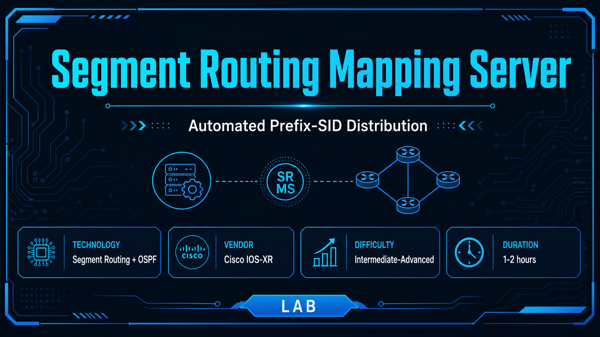
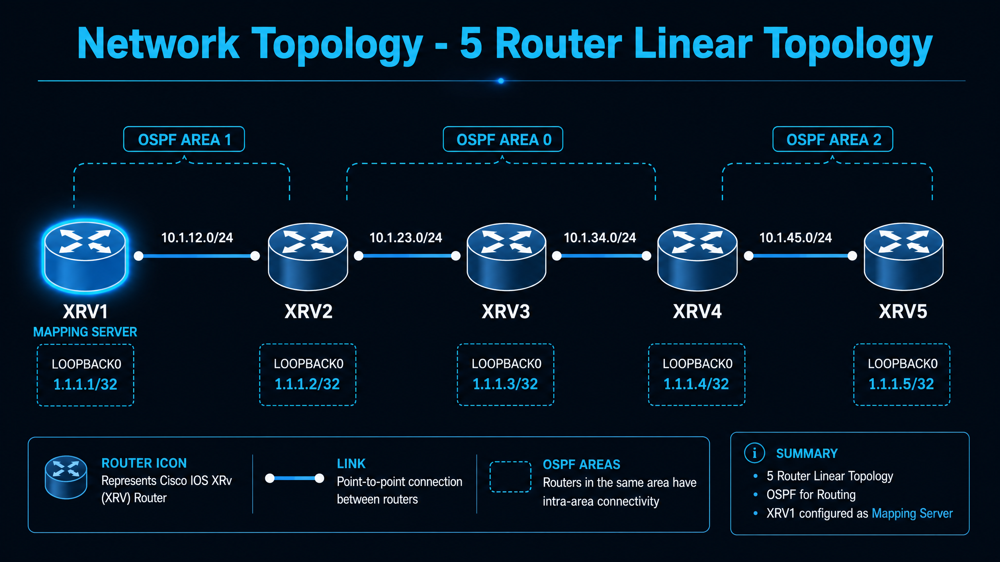
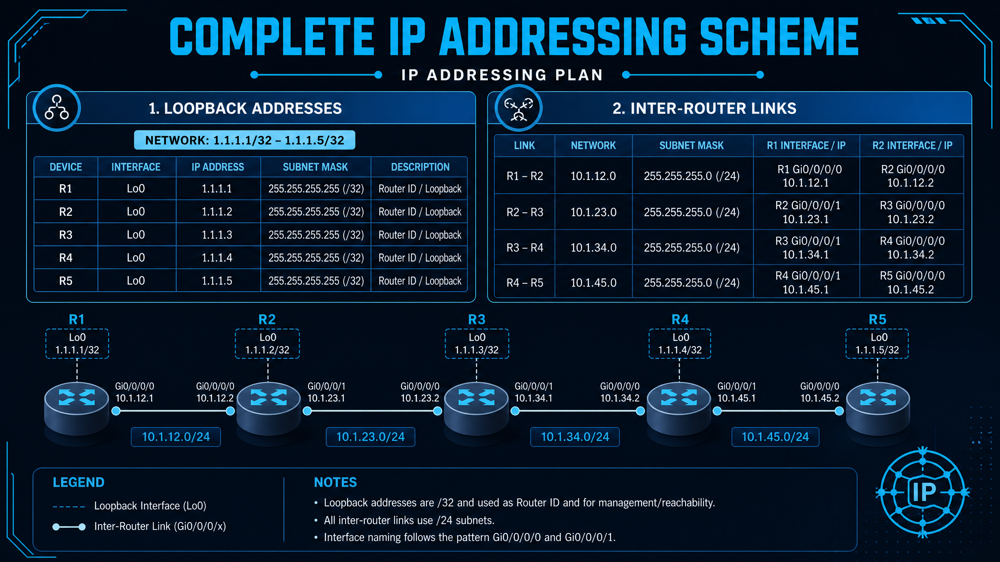
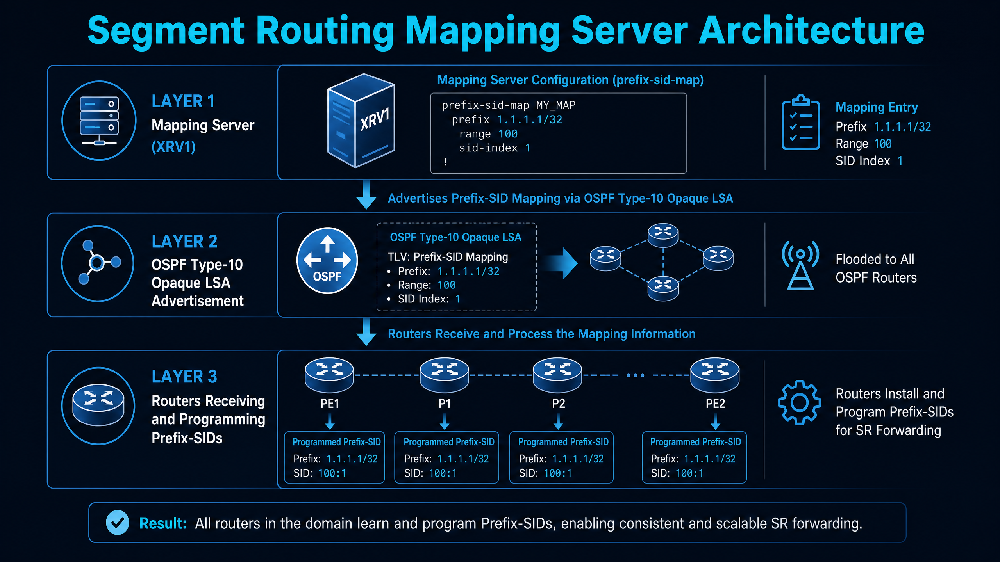
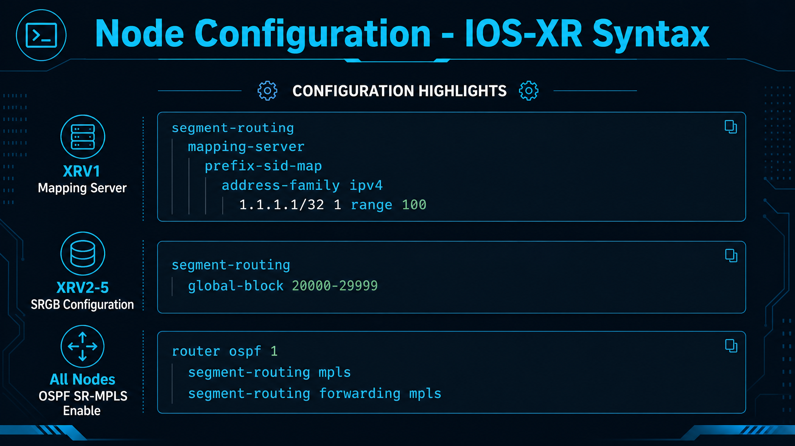
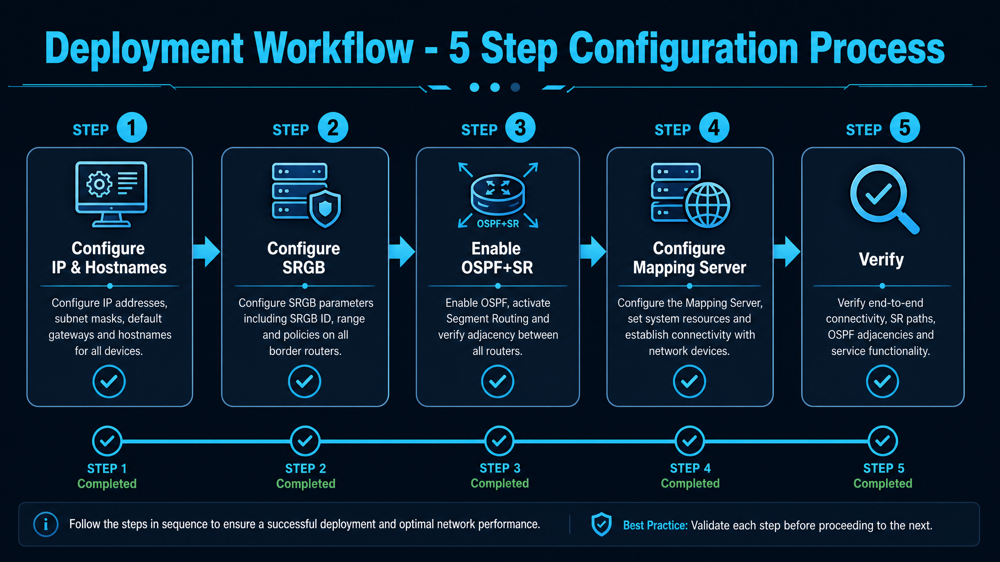
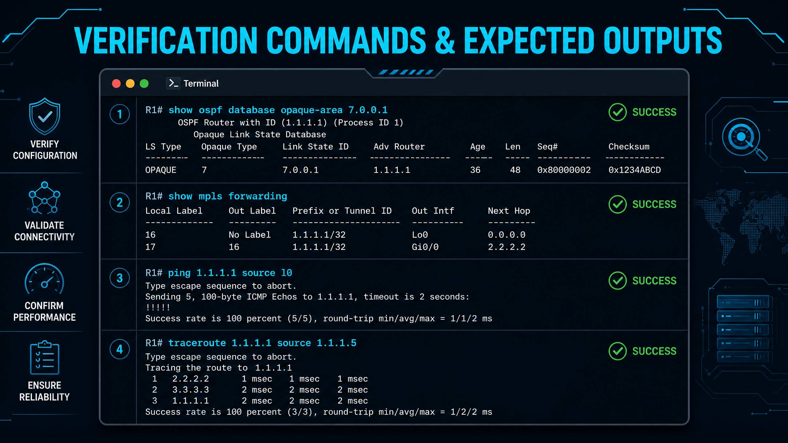
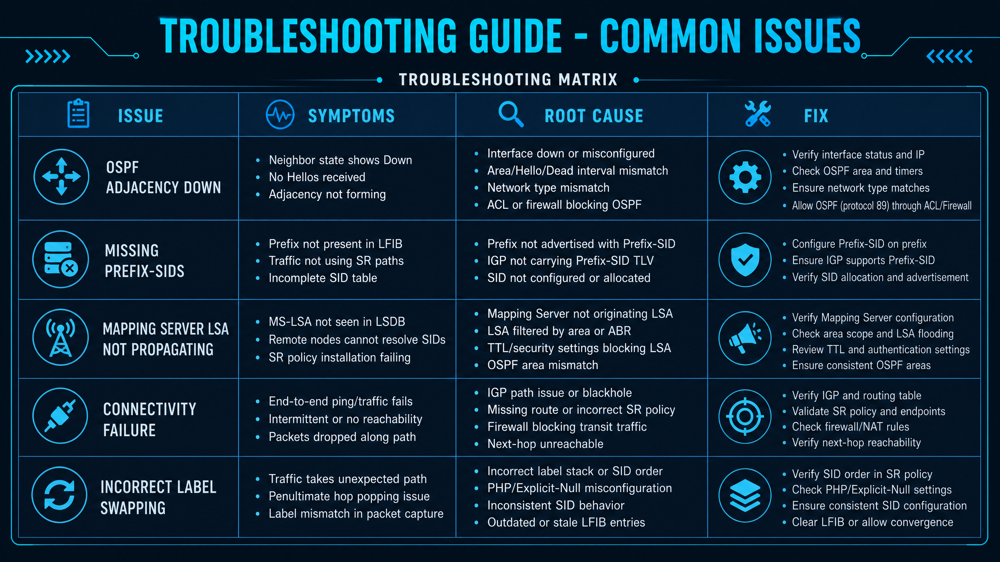
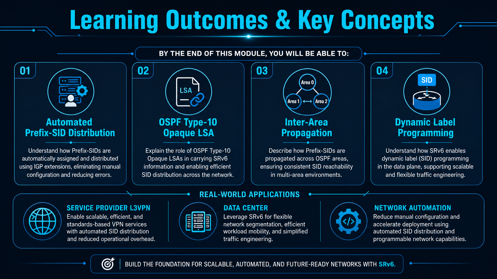
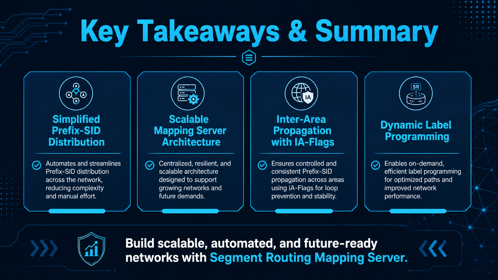

# Segment Routing Using a Mapping Server (SRMS)

A hands-on Cisco IOS-XR lab that demonstrates how a **Segment Routing Mapping Server**
distributes Prefix-SIDs on behalf of nodes that never configure one themselves, and how
those advertisements cross OSPF area boundaries without looping.

Five IOS-XR routers run OSPF with Segment Routing enabled. Only **R1** carries any
Prefix-SID configuration at all — it acts as the mapping server and advertises a SID
range covering every loopback in the fabric. R2–R5 learn their own Prefix-SIDs, and each
other's, purely from R1's advertisement, then build a working MPLS label-switched path
end to end.

---

## Topology



> The diagrams label the routers **XRV1–XRV5**; the configs and text below use
> **R1–R5**. Same five devices, same roles.

```
     Area 1                 Area 0                      Area 2
  ┌───────────┐   ┌──────────────────────────┐   ┌───────────────┐

   [R1] ───────── [R2] ───────── [R3] ───────── [R4] ───────── [R5]
        10.1.12.x      10.1.23.x      10.1.34.x      10.1.45.x
    Gi0/0/0/0  Gi0/0/0/0   Gi0/0/0/1  Gi0/0/0/1   Gi0/0/0/0  Gi0/0/0/0  Gi0/0/0/1   Gi0/0/0/1
       ▲
       │
  Mapping Server
```

A deliberately multi-area design — R2 is the ABR between area 1 and area 0, R4 is the ABR
between area 0 and area 2. That is the point of the lab: it forces the mapping server
advertisement to be re-originated across area boundaries, which is where the IA-flag
loop-prevention behaviour becomes visible.

| Router | Role | Areas | Loopback0 |
|--------|------|-------|-----------|
| R1 | Mapping Server, internal | Area 1 | 1.1.1.1/32 |
| R2 | ABR | Area 1 ↔ Area 0 | 1.1.1.2/32 |
| R3 | Internal (backbone) | Area 0 | 1.1.1.3/32 |
| R4 | ABR | Area 0 ↔ Area 2 | 1.1.1.4/32 |
| R5 | Internal, remote edge | Area 2 | 1.1.1.5/32 |

### Addressing



| Link | Subnet | Near end | Far end |
|------|--------|----------|---------|
| R1 ↔ R2 | 10.1.12.0/24 | R1 Gi0/0/0/0 — .1 | R2 Gi0/0/0/0 — .2 |
| R2 ↔ R3 | 10.1.23.0/24 | R2 Gi0/0/0/1 — .2 | R3 Gi0/0/0/1 — .3 |
| R3 ↔ R4 | 10.1.34.0/24 | R3 Gi0/0/0/0 — .3 | R4 Gi0/0/0/0 — .4 |
| R4 ↔ R5 | 10.1.45.0/24 | R4 Gi0/0/0/1 — .4 | R5 Gi0/0/0/1 — .5 |

---

## Why a Mapping Server



In a normal Segment Routing deployment every node configures its own Prefix-SID under its
loopback and floods it in an IGP Prefix-SID sub-TLV. That works, but it means touching
every device — and it does not work at all for nodes that cannot originate a Prefix-SID,
which is the classic LDP-to-SR migration problem.

A **mapping server** solves both. One node (here, R1) is configured with a
*prefix-to-SID mapping range*, and the IGP floods that mapping to everyone else. Each
receiving router applies the mapping to prefixes it already has in its LSDB and programs
the resulting labels itself. Nothing is configured on R2–R5 beyond enabling SR.

The mapping in this lab is a single range:

```
1.1.1.1/32  index 1  range 100
```

Read as: *starting at prefix 1.1.1.1/32, assign SID index 1, and continue for 100
consecutive prefixes.* So 1.1.1.1 → index 1, 1.1.1.2 → index 2, 1.1.1.3 → index 3, and so
on through 1.1.1.100 → index 100. One line covers the whole fabric.

---

## Configuration



Full per-device configs live in [`configs/`](configs/). The parts that matter:

### The mapping server — R1 only

```
segment-routing
 mapping-server
  prefix-sid-map
   address-family ipv4
    1.1.1.1/32 1 range 100
```

### Enabling SR in OSPF — every router

```
router ospf 1
 segment-routing mpls
 network point-to-point
 segment-routing forwarding mpls
```

`segment-routing mpls` turns on SR extensions for the process; `segment-routing
forwarding mpls` programs the MPLS data plane. `network point-to-point` avoids DR/BDR
election on the Ethernet links, which keeps the SR adjacency SIDs clean.

### SRGB

All five routers in this build use the IOS-XR default SRGB of **16000–23999**:

```
segment-routing
 global-block 16000 23999
```

The SRGB is a *local* label range — it does not have to match between nodes, because each
router derives its own local label as `its own SRGB base + SID index`. Giving each router
a distinct SRGB (R2 = 20000–29999, R3 = 30000–39999, and so on) is a useful variation to
run afterwards: the pings still succeed, but a `traceroute` shows the label changing at
every hop, which proves the index — not the label — is what is actually being advertised.

---

## Deployment order



1. **Interfaces and hostnames** — loopbacks and the four point-to-point links.
2. **SRGB** — set the global block before OSPF brings SR up, so labels are allocated
   from the intended range the first time.
3. **OSPF with SR** — the process, the areas, and `segment-routing forwarding mpls`.
   Confirm all four adjacencies reach FULL before going further.
4. **Mapping server** — the `prefix-sid-map` range, on R1 only.
5. **Verify** — LSA, then labels, then data plane.

Do not skip step 3's adjacency check. A mapping server advertisement that never floods
looks identical to one that was never configured.

---

## Verification



### 1. The advertisement itself — on R1

```
show ospf database opaque-area 7.0.0.1
```

The mapping is carried in a **Type-10 Opaque LSA, Opaque Type 7** — the *Extended Prefix
Range* LSA. Expect to see the prefix, the range size and the starting SID index:

```
  Link State ID: 7.0.0.1
  Opaque Type: 7
  Advertising Router: 1.1.1.1

    Extended Prefix Range TLV: Length: 24
      Prefix    : 1.1.1.1/32
      Range Size: 100
      Flags     : 0x0
      SID sub-TLV: Length: 8
        Algo      : 0
        SID Index : 1
```

Note `Flags: 0x0` — this is the original advertisement, inside area 1.

### 2. Crossing an area boundary — on R2

```
show ospf database opaque-area 7.0.0.1 self-originate
```

R2 is the ABR. Because Type-10 LSAs are area-scoped, R2 does not flood R1's LSA into
area 0 — it **re-originates** its own copy, with itself as the advertising router and one
important difference:

```
  Advertising Router: 1.1.1.2
      Prefix    : 1.1.1.1/32
      Range Size: 100
      Flags     : 0x80        ← IA-flag set
```

The **IA (inter-area) flag** is the loop-prevention mechanism. An ABR will not propagate a
mapping server advertisement that arrived from a *non-backbone* area with the IA-flag
already set. Without it, two ABRs on the same pair of areas would re-originate each
other's copies indefinitely.

### 3. Programmed labels — on R5

```
show mpls forwarding
```

R5 is four hops and two area boundaries away from the mapping server, and has no
Prefix-SID configuration of its own — yet it has labels for every loopback in the fabric:

```
Local  Outgoing    Prefix             Outgoing     Next Hop
Label  Label       or ID              Interface
------ ----------- ------------------ ------------ ---------------
16000  Pop         SR Adj (idx 0)     Gi0/0/0/1    10.1.45.4
16001  16001       SR Pfx (idx 1)     Gi0/0/0/1    10.1.45.4
16002  16002       SR Pfx (idx 2)     Gi0/0/0/1    10.1.45.4
16003  16003       SR Pfx (idx 3)     Gi0/0/0/1    10.1.45.4
16004  Pop         SR Pfx (idx 4)     Gi0/0/0/1    10.1.45.4
```

`SR Pfx (idx N)` is the tell — the index came from the mapping server, and the local
label is `SRGB base + idx`. Index 4 pops because R4 is the penultimate hop for 1.1.1.4.

With a uniform SRGB the local and outgoing labels match, so also run:

```
show segment-routing mapping-server prefix-sid-map ipv4 detail
show ospf segment-routing prefix-sid-map
```

to see the received mapping and how the local router resolved it.

### 4. Data plane — on R5

```
ping 1.1.1.1 source Loopback0
traceroute 1.1.1.1 source 1.1.1.5
```

```
Sending 5, 100-byte ICMP Echos to 1.1.1.1 ...
!!!!!
Success rate is 100 percent (5/5)

 1  10.1.45.4 [MPLS: Label 16001 Exp 0]
 2  10.1.34.3 [MPLS: Label 16001 Exp 0]
 3  10.1.23.2 [MPLS: Label 16001 Exp 0]
 4  10.1.12.1
```

Every hop is label-switched, and the whole path was built without a single Prefix-SID
configured outside R1.

---

## Troubleshooting



| Symptom | Likely cause | Check |
|---------|--------------|-------|
| No Opaque Type 7 LSA anywhere | Mapping server not active | `show segment-routing mapping-server prefix-sid-map ipv4 detail` on R1 |
| LSA present on R1, absent beyond R2 | ABR not re-originating, or adjacency down | `show ospf neighbor` on R2; confirm R2 has interfaces in both area 1 and area 0 |
| Prefix-SIDs learned but no MPLS labels | SR forwarding not enabled | `segment-routing forwarding mpls` must be under `router ospf 1` |
| Labels present, ping fails | Loopback not advertised into OSPF | Confirm Loopback0 is under an `area` with `passive enable` |
| Labels outside the expected range | SRGB applied after OSPF came up | Re-set `global-block`, then `clear ospf process` |
| Wrong SID index on a loopback | Range too small, or wrong start prefix | Range must cover every loopback from the start prefix onward |

A useful sanity rule: if the LSA is correct on the mapping server but a remote router has
no `SR Pfx` entries, the problem is flooding or area design, not the mapping itself.

---

## What this lab teaches



- Configuring a Segment Routing mapping server and a prefix-to-SID mapping range on IOS-XR
- How OSPF carries SR information in Type-10 Opaque LSAs, and specifically what Opaque
  Type 7 (Extended Prefix Range) is for
- Why the SRGB is a local construct and the SID index is the global one
- How ABRs re-originate mapping server advertisements between areas, and what the IA-flag
  prevents
- Reading `show mpls forwarding` well enough to tell a mapping-server-derived Prefix-SID
  from a locally configured one


Questions worth being able to answer after building this:

- Why would you deploy a mapping server instead of configuring Prefix-SIDs per node?
- What happens if two mapping servers advertise overlapping ranges?
- Why is the SRGB allowed to differ between routers, and what breaks if the SID index
  differs instead?
- What exactly does the IA-flag prevent, and in what topology would the loop occur?
- How does a mapping server support an LDP-to-SR migration?

---

## Repository layout

```
configs/     Per-device IOS-XR configurations (R1–R5)
docs/        Task walkthrough and command reference
images/      Diagrams and reference cards
```

- [`docs/lab-guide.md`](docs/lab-guide.md) — step-by-step build, task by task
- [`docs/verification.md`](docs/verification.md) — command reference with expected output

---



## Notes

Built and verified on Cisco IOS-XRv. Any IOS-XR platform supporting OSPF Segment Routing
should behave identically; the interface names are the only thing likely to change.

All configurations, documentation and diagrams in this repository are original work,
released under the [MIT License](LICENSE).
